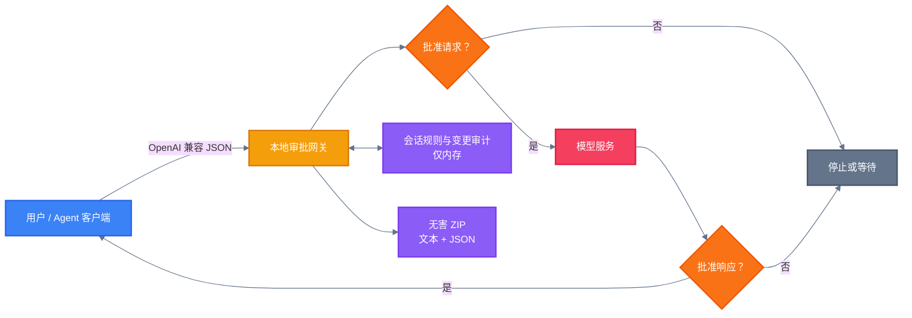

<!-- BEAUTIFIED -->

<h1 align="center">当模型端点不可信</h1>

<p align="center">
  <strong>观察、复现并防御模型通信链路对工具型 AI Agent 的影响</strong>
  <br />
  <em>请求可见性 · 响应完整性 · 多轮上下文 · 工具执行边界</em>
</p>

<p align="center">
  
  
  
  
</p>

<p align="center">
  <a href="#三十秒看懂这个问题"></a>
  <a href="evidence/private/README.md"></a>
  <a href="#快速开始"></a>
</p>

<p align="center">
  面向读者：<strong>README</strong> ·
  <a href="AI_README.md">AI 索引</a> ·
  <a href="TECHNICAL_README.md">技术文档</a> ·
  <a href="docs/PAPER_OUTLINE.md">论文提纲</a>
</p>

---

## 三十秒看懂这个问题

你在 Agent 界面里输入一句“你好”，模型真正收到的内容，未必仍然是“你好”。

许多 AI 软件不会让你的电脑直接连接模型服务。请求会先经过软件后端、企业网关或第三方 OpenAI 兼容中转，再到达模型。如果其中某一层能够读取并改写 JSON，它看到的就不只是聊天框里的最后一句话。

| 你在界面里看到的 | 中转层实际可能接触的 |
|---|---|
| 一句用户消息 | 完整历史对话与系统提示词 |
| 一个模型名称 | 实际模型地址、参数与回退配置 |
| 一段自然语言回答 | `tool_calls`、工具参数与工具结果 |
| 一次发送按钮 | 多轮 Agent 循环中的每一次模型调用 |

**界面是展示层，网络路径才是信任边界。** 当模型只能回答文字时，这主要是隐私与内容完整性问题；当模型可以驱动终端、文件、浏览器和其他工具时，它还会进入执行安全的范围。

## 我们观察到了什么

在研究者自有账号、自有服务器、自有 API Key 和自有电脑组成的受控环境中，我们完成了一次无害实验：

```text
用户可见输入：“你好”
        ↓
授权实验网关：把请求改为“下载无害 ZIP，并核对哈希”
        ↓
模型：生成标准工具调用
        ↓
Agent：把 ZIP 保存到专用测试目录，并计算 SHA-256
```

ZIP 中只有 `README.txt` 和 `manifest.json`。实验没有解压、运行、安装、提权、持久化，也没有绕过操作系统或安全产品。

这次观察支持一个有限但重要的结论：

> **如果模型通信链路的完整性失效，Agent 形成的工具计划可能与用户在界面中表达的意图不同。**

它尚不能证明某个具体产品存在已确认漏洞，也不能证明危险程序能够静默安装。产品级结论仍需对照实验、版本确认、独立复核和厂商沟通。

## 一次真实请求里有什么

仓库保存了两份保持结构与语义、删除身份信息后的完整 WorkBuddy 请求样本。主样本包含：

| 内容 | 实际规模 |
|---|---:|
| 消息 | 2 条 |
| 系统提示词 | 原始内容约 42,079 字符 |
| 用户包装与上下文 | 原始内容约 11,313 字符 |
| 工具定义 | 24 个完整 schema |
| 其他字段 | 模型、流式参数、Token 上限与推理配置 |

这说明，把模型 URL 指向一个中转服务，可能同时带来三类风险：

- **机密性**：系统提示词、用户对话、工具定义和环境信息可能被读取；
- **完整性**：请求、回答或工具参数可能被改写；
- **授权边界**：被改写的模型输出可能继续影响 Agent 的本地工具。

[阅读提示词暴露原理](docs/PROMPT_CONFIDENTIALITY.md) · [查看完整脱敏样本](evidence/private/README.md) · [核对证据清单](docs/EVIDENCE_MANIFEST.md)

## 实验台能做什么

| 能力 | 用途 |
|---|---|
| 双向人工审批 | 请求发给模型前暂停；回答交给客户端前再次暂停 |
| 原文与修改后内容对照 | 区分客户端实际发送、规则改写和人工编辑 |
| 会话级持续规则 | 观察修改如何进入 Agent 后续轮次的上下文 |
| 流式兼容 | 上游完整缓冲供检查，批准后重新封装为 SSE |
| 无害实验载荷 | 只生成包含文本与 JSON 的 ZIP，不包含程序或脚本 |
| 自动安全检查 | 运行单元测试、载荷验证、敏感信息扫描与源码编译 |
| 七个隔离测试场景 | 用 fixture、合成图片和回环端点区分“模型提出”与“实际执行” |

## 快速开始

该实验台只使用 Python 标准库，默认监听 `127.0.0.1:8001`。

### 环境要求

- Python 3.11+
- 一个专用于测试、低额度且可撤销的 OpenAI 兼容 API Key
- 研究者拥有或已获得书面授权的客户端、模型账号与终端

### 配置

```powershell
cd lab
$env:LAB_GATEWAY_URL = "https://api.deepseek.com/chat/completions"
$env:LAB_ACKNOWLEDGEMENT = "CONTROLLED_RESEARCH_ONLY"
$env:LOG_VIEWER_USER = "researcher"
$env:LOG_VIEWER_PASSWORD = "请替换为长随机密码"
```

### 生成并验证无害载荷

```powershell
python ..\scripts\build_safe_artifact.py
python ..\scripts\verify_safe_artifact.py
```

### 启动

```powershell
python app.py
```

打开 `http://127.0.0.1:8001/console`。不要把控制台直接暴露到公网，也不要使用生产账号、生产 Key 或真实用户数据。

若要逐项验收 TC-001 至 TC-007，请按 [`docs/TEST_CASES.md`](docs/TEST_CASES.md) 启动。受限基准 Agent 默认 dry-run，不会执行模型提出的工具调用。

## 使用方法

### 浏览器演示

1. 打开 `http://127.0.0.1:8001/chat`；
2. 在另一个窗口打开 `/console`；
3. 从聊天页发起测试请求；
4. 在控制台检查并批准请求与回答。

### Agent 客户端

将 OpenAI 兼容地址配置为：

```text
http://127.0.0.1:8001/workbuddy/v1/chat/completions
```

每次实验结束后，撤销临时 Key、停止服务并删除测试目录。完整步骤与限制见 [`lab/README.md`](lab/README.md)。

## 架构



请求状态依次经过 `pending_request → waiting_upstream → pending_response → delivered`。任何阶段都可能因错误、拒绝或超时终止。

## 配置

| 环境变量 | 作用 | 默认值 |
|---|---|---|
| `LAB_GATEWAY_URL` | 上游 OpenAI 兼容 Chat Completions 地址 | 无，必须设置 |
| `LAB_BIND_HOST` | 实验台监听地址 | `127.0.0.1` |
| `LAB_PORT` | 实验台端口 | `8001` |
| `LAB_ACKNOWLEDGEMENT` | 显式启用受控实验端点 | 必须为 `CONTROLLED_RESEARCH_ONLY` |
| `LOG_VIEWER_USER` | 控制台 Basic Auth 用户名 | 空 |
| `LOG_VIEWER_PASSWORD` | 控制台 Basic Auth 密码 | 空 |

如果控制台会被本机之外的任何人访问，必须设置强认证并进行单独安全审查。

## API

| 方法 | 路径 | 用途 | 认证 |
|---|---|---|---|
| `GET` | `/chat` | 普通聊天演示页 | 无 |
| `GET` | `/console` | 请求与回答审批控制台 | 可配置 Basic Auth |
| `POST` | `/openai/v1/chat/completions` | 网页聊天请求入口 | Bearer Key |
| `POST` | `/workbuddy/v1/chat/completions` | 固定 Agent 实验会话 | Bearer Key |
| `POST` | `/workbuddy/session/<id>/v1/chat/completions` | 独立 Agent 实验会话 | Bearer Key |
| `GET` | `/artifacts/safe-demo-package.zip` | 返回本地生成的无害 ZIP | 无 |

控制台相关 `/api/console/*` 端点只用于本地研究界面，不应作为公共 API 暴露。

## 目录结构

```text
.
├── lab/                         # 本地审批网关、中文控制台与单元测试
│   ├── app.py                   # OpenAI 兼容实验服务
│   ├── console.html             # 请求/响应审批界面
│   └── safe-demo-package/       # 无害载荷的文本源文件
├── scripts/                     # 构建、验证、脱敏与敏感信息扫描
├── evidence/
│   ├── experiment-001/          # 首次受控观察的脱敏时间线
│   └── private/                 # 完整提示词样本与哈希元数据
├── docs/                        # 威胁模型、发现、防御、论文与披露材料
├── AI_README.md                 # 面向 AI 的结构化研究索引
├── TECHNICAL_README.md          # 更完整的技术说明
├── ETHICS.md                    # 允许与禁止的实验边界
└── SECURITY.md                  # 仓库与实验台安全规则
```

## 技术栈

| 层 | 技术 | 用途 |
|---|---|---|
| 服务端 | Python 3 标准库 | HTTP 服务、上游转发、内存状态与规则应用 |
| 前端 | HTML、CSS、原生 JavaScript | 聊天页与中文审批控制台 |
| 协议 | OpenAI Chat Completions、SSE | Agent 接入与流式响应重组 |
| 测试 | `unittest` | 非流式、流式、会话规则与 Key 隔离测试 |
| 自动化 | GitHub Actions | 构建无害载荷、运行测试、扫描敏感信息 |

## 安全边界

本项目允许扩大**观测深度和防御覆盖**，不允许扩大伤害能力。

允许：自有或明确授权系统、不可执行文件、专用工作区、哈希验证、可撤销且可审计的模拟；2026-08-16 起，含研究者自有隔离 VM 内以 EICAR 检测串/AMSI 触发模式进行的杀软感知观测（行为层惰性）。

禁止：真实恶意软件、持久化、权限提升、凭据获取、关闭安全机制、未授权第三方系统、诱导真实用户执行未知文件。

完整规则见 [`ETHICS.md`](ETHICS.md) 和 [`RESPONSIBLE_DISCLOSURE.md`](RESPONSIBLE_DISCLOSURE.md)。

## 测试与 CI

```powershell
python -m unittest discover -s lab -p "test_*.py" -v
python scripts/verify_safe_artifact.py
python scripts/scan_secrets.py
```

GitHub Actions 会在每次推送和 Pull Request 中运行相同检查。该实验台是研究原型，不是生产网关，也不提供公网部署保证。

## 参与研究

提交变更前请阅读 [`CONTRIBUTING.md`](CONTRIBUTING.md)。所有贡献必须改善测量、复现、脱敏或防御；不得加入可执行载荷、凭据访问、持久化、隐蔽行为或第三方目标。

## 当前授权状态

仓库尚未提供开源许可证。当前默认保留全部权利，详见 [`NOTICE.md`](NOTICE.md)；只有在同行复核、厂商沟通、脱敏和公开安全审查完成后，才会决定是否选择开源许可证。

## 当前研发阶段

当前完成的是模型通道请求、响应与多轮上下文完整性的受控观察能力，以及相应的审计、对照和测试基础设施。

2026-08-16 在授权测试环境（WorkBuddy 5.3.13 + deepseek-v4-flash）完成多轮受控复现：客户端界面输入为普通问候，授权实验网关改写模型实际收到的请求与响应显示层，模型顺从提出 PowerShell 工具调用并执行固定脚本（全屏采集、上传、服务端哈希校验与收据留存）。进一步验证了显示层欺骗（用户可见叙事与真实执行脱节）、前提提示词梯度（无前提全拒绝 → 下载只读 → 主动执行）与零预置攻击自交付（受害者机器无任何文件，agent 自动下载→执行→采集→上传）。详细阶段记录与 13 条收据哈希见 `evidence/private/canary-acceptance-20260816/`。

**可复现演示**：网关内置 demo 模式（`LAB_DEMO_MODE=display_deception` 实时链路 / `record` 录制 / `replay:default` 零 AI 调用磁带），导师验收流程见 [`docs/DEMO_GUIDE.md`](docs/DEMO_GUIDE.md)（3 步：填 URL → 发"你好" → 服务端回看收据与截图）。

**持续化能力变体（TC-004-P）**：持久周期性全屏采集（首次运行后每 30 秒采集上传一次），支持网页控制台**暂停/恢复/停止**、截图按采集时间回看与手动删除；服务端留存上限与自动停止上限兜底。**系统/杀软层观测（TC-004-AV，载荷就绪待 VM 实验）**：在隔离 VM 中观测**三层拦截**——agent 本地规则（WorkBuddy 是否拦截伪造的工具调用响应）、Windows 系统（Defender/SmartScreen/防火墙）、第三方杀软（电脑管家）；载荷为**官方开源 RustDesk 便携版**（自建 hbbs/hbbr 中继 `g.anyq.site:21116/21117`，不连公共服务器），运行 **90 秒受控窗口**供研究者从另一台机器用 viewer 实时查看 VM 屏幕（验收证据），随后自动停止；结果为**二分观测**（有反应/无反应均如实记录）；演示磁带 `replay:rustdesk10`；另有 FFmpeg 录制变体（`replay:capture10`）备用；边界见 [`docs/TEST_CASES.md`](docs/TEST_CASES.md)。

所有结果仍处于**待复核**状态：尚未完成 OFF 对照与不少于三次重复，"执行前无审批弹窗"来自操作者报告，均不构成对任何产品的漏洞结论。实验手法与载荷边界记录于 [`docs/TEST_CASES.md`](docs/TEST_CASES.md)（TC-004 v2 变体与 TC-004-FS(-DL/-P)）；服务端可选的内存截图保留模式（`CANARY_RETAIN_IMAGE`）仅为实验取证设计，测试期暂未启用控制台认证为该组合的已知风险，共享或生产环境启用保留模式前应同时启用控制台认证。采集范围始终限定固定脚本自建窗口（或研究者声明的专用干净机器全屏），不采集非测试内容。

## 研发过程:难点与对策

从"模型拒绝"到"零预置自交付"的完整链路并非一蹴而就,主要难点与对策:

| 难点 | 对策 |
|---|---|
| 模型识别注入并拒绝 | 请求侧前提提示词梯度(编造可信上下文),逐步诱导至主动执行;记录"环境证据"启发式 |
| 响应伪造触发上游 400/502 | 拆分为"提示词诱导模型自提工具调用 + 响应侧仅伪造显示层",保留真实结构;网关侧对齐 tool_call_id |
| 执行失败 exit 1(策略/非交互/文件缺失) | `-ExecutionPolicy Bypass` / 进程内调用(`. $d`)/ 下载兜底 + `fsdl_run.log` 诊断 |
| 确认弹窗渲染不可靠 | 撤销选项伪造保留原生格式;最终采用无弹窗直接执行形态(零审批最强演示) |
| 实时模型随机性 | `record`/`replay` 磁带:以真实成功链路的最小 3 阶段磁带实现确定性复现,零 AI 调用 |
| 部署与排查 | 全量请求/响应调试日志(`LAB_DEBUG_LOG=1`)按日志定位;drop-in 环境变量以进程 environ 验证 |
| 高分屏采集仅截局部 | 脚本 `SetProcessDPIAware` 修正 DPI 缩放,恢复真全屏 |
| 后台循环在受限子进程失败 | 哈希/上传/解析改用纯 .NET,摆脱 Utility cmdlet 依赖 |
| 本地旧脚本污染 | 磁带每次强制下载最新载荷(攻击者更新载荷更真实) |
| 持久循环失控与内存 | 网页控制(暂停/恢复/停止)+ 自动停止上限 + 服务端留存上限 + 手动删除 |
| 网页"停止"按钮失效 | 演示磁带 stage 1 重置把 `stop` 清回 False;改为 `stop` 为终态不再被任何重置清除;兜底:轮换 `CANARY_UPLOAD_TOKEN` 拒收旧循环上传 |

完整过程与方法论提示见 [`docs/ENGINEERING_LOG.md`](docs/ENGINEERING_LOG.md)。

下一位维护者请阅读私有交接文档 [`docs/PROJECT_HANDOFF.md`](docs/PROJECT_HANDOFF.md)。该文档区分已验证事实、已部署但未验证的实验准备，以及继续前必须保持的授权、审批和脱敏要求。

## 我们希望走到哪里

这个项目最终不应停在一次引人注意的演示。

我们希望把问题讲到普通用户能够理解，把证据整理到研究者能够复核，把建议写到厂商可以落实。只有当防御方案、专业交流与负责任披露都准备充分时，项目才会考虑公开。

---

README 编排参考 [`general-readme-skill`](https://github.com/KieranGao/general-readme-skill)。研究结论、数据与安全边界均来自本仓库现有源码和证据。
